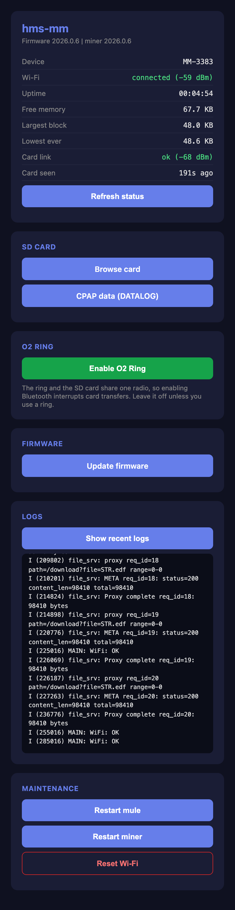
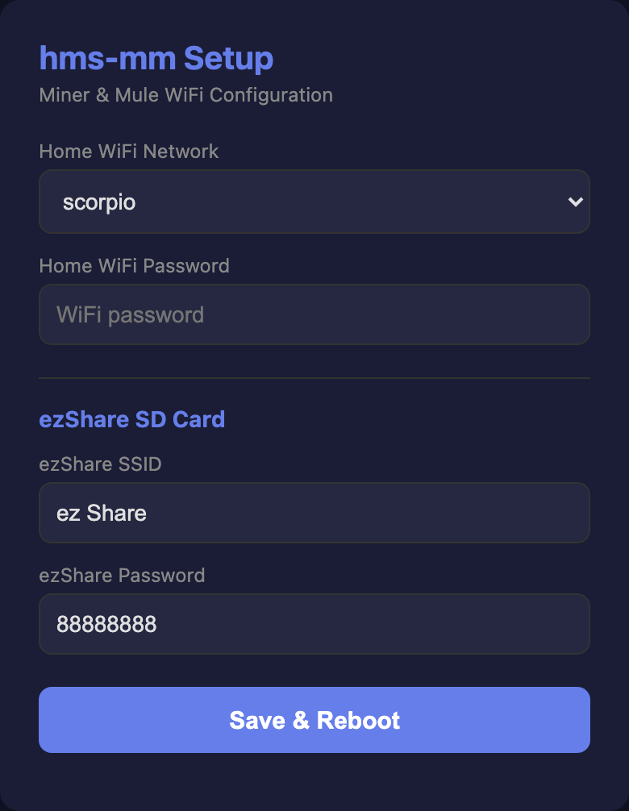
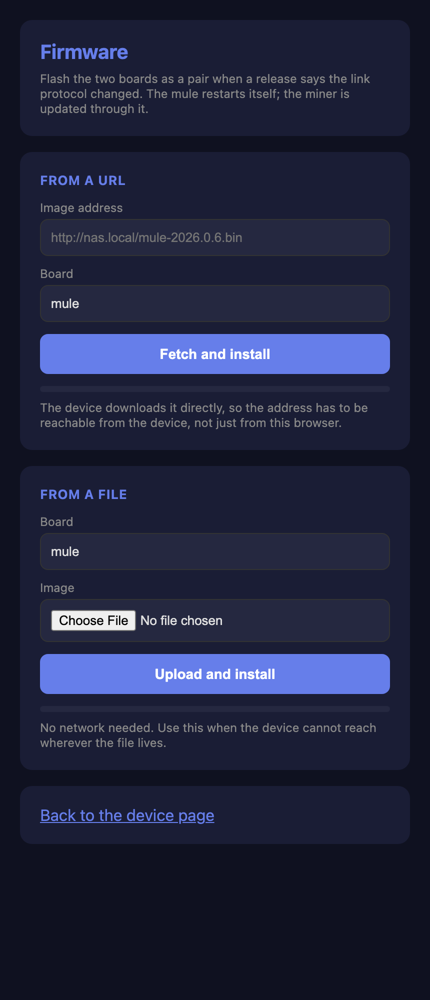

# hms-mm

[](LICENSE)
[](https://docs.espressif.com/projects/esp-idf/)

Dual ESP32-C3 proxy bridge for WiFi SD cards and Wellue O2Ring oximeters. The mule connects to your home WiFi and runs an HTTP server. When a client requests a file, the mule forwards the request to the miner over UART. The miner connects to the SD card's WiFi AP or O2Ring via BLE, fetches the data, and streams it back chunk by chunk.

Solves the "two WiFi networks" problem: WiFi SD cards create their own AP, so a single-radio device can't be on both the SD card's network and your home network simultaneously. Two ESP32-C3s, connected by UART, each handle one network. The miner also supports BLE connections to a Wellue O2Ring for oximetry data (SpO2, heart rate, stored session files).

## The device page

Point a browser at the mule for status, the SD card, firmware updates, recent
logs and the maintenance actions. No app, no account, no cloud.



## Architecture

```
WiFi SD Card AP       UART, newline JSON       Home Network
(192.168.4.1)            TX/RX crossed           (your router)
    |                                                 |
    v  WiFi                                     WiFi  v
+------------------+   GPIO 2/3 UART  +------------------+
|  Miner (ESP32-C3)|  <------------>  |  Mule (ESP32-C3) |
|                  |                  |                  |
|  Connects to SD  |  proxy_req -->   |  HTTP server :80 |
|  card WiFi on    |  <-- proxy_meta  |  Forwards /dir & |
|  demand, streams |  <-- proxy_chunk |  /download to    |
|  chunks back     |  chunk_ack -->   |  miner via UART  |
|                  |  o2ring_req -->  |                  |
|  Connects to     |  <-- o2ring_*   |  /o2ring/* API   |
|  O2Ring via BLE  |                  |                  |
+------------------+                  +------------------+
       ^                                    |
       |  BLE                               v  HTTP
  O2 Ring                             Browser / App
```

**Request flow:**

1. Client sends `GET /dir?dir=A:DATALOG` to the mule
2. Mule takes the link lock and sends `proxy_req` over UART
3. Miner connects to the ezShare WiFi on demand and fetches from the card
4. Miner sends `proxy_meta` (status, length), then `proxy_chunk` frames
5. Mule verifies each chunk, streams it to the HTTP client, and replies
   `chunk_ack`
6. Mule refuses to finalise the response unless the byte count matches the
   length the card promised
7. Miner disconnects from the ezShare WiFi after an idle timeout (5 min)

## Setup

### 1. Install ESP-IDF

Requires [ESP-IDF v5.x](https://docs.espressif.com/projects/esp-idf/en/stable/esp32c3/get-started/).

```bash
. ~/esp/esp-idf/export.sh
```

### 2. Wire UART

Connect miner and mule with 2 signal wires + ground. Both boards use the same
pins (TX = GPIO2, RX = GPIO3); cross them so each board's TX reaches the other's RX:

| Miner | Mule | Signal |
|-------|------|--------|
| GPIO 3 (RX) | GPIO 2 (TX) | Mule TX -> Miner RX |
| GPIO 2 (TX) | GPIO 3 (RX) | Miner TX -> Mule RX |
| GND | GND | Common ground |
| 3V3 | 3V3 | Shared power rail (power either board) |

Tie the two 3V3 pins together and you can power the whole bridge from a single
USB-C on either board. GPIO2 is a strapping pin, but it is always the TX line
(which idles high), so it stays boot-safe. Prefer the
[3D-printed board](hardware/3d-pcb/) below, which does the TX/RX crossover and the
3V3/GND rails for you in copper.

> **If you have built this before, delete `sdkconfig` first.** ESP-IDF only reads
> `sdkconfig.defaults` when `sdkconfig` does not already exist, so an existing
> build directory silently ignores new defaults. That is not cosmetic here: it
> is how OTA rollback protection came to be switched off on a board whose
> firmware reported it as enabled. Verify after building:
>
> ```bash
> grep CONFIG_BOOTLOADER_APP_ROLLBACK_ENABLE mule/sdkconfig miner/sdkconfig
> ```

### 3. Build and Flash

```bash
# Flash miner
cd miner
idf.py set-target esp32c3
idf.py build
idf.py -p /dev/cu.usbmodemXXXX flash

# Flash mule (separate USB port)
cd ../mule
idf.py set-target esp32c3
idf.py build
idf.py -p /dev/cu.usbmodemYYYY flash
```

### 4. Configure WiFi (Captive Portal)




On first boot (or after `idf.py erase-flash`), the mule creates an open WiFi AP:

**AP name:** `MM-Setup-XXXX` (last 4 chars of device serial)

1. Connect to the AP from your phone or laptop
2. A setup page opens automatically (or go to `http://192.168.4.1`)
3. Enter your **home WiFi** credentials (SSID + password)
4. Enter the **SD card WiFi** credentials (e.g. `ez Share` / `88888888` for ezShare cards)
5. Save

On save:
- Mule stores home WiFi credentials in NVS
- Mule sends SD card WiFi credentials to miner over UART
- Miner stores SD card credentials in NVS
- Both devices reboot with the new credentials

Credentials persist across reboots. To re-enter setup, use **Reset Wi-Fi** on the
device page (or `POST /api/reset`), which keeps the card settings. `idf.py
erase-flash` also works and forgets everything.

### 5. Test

```bash
# Check mule is up
curl "http://<MULE_IP>/api/status"
# {"serial":"MM-4F2A","fw":"2026.0.6","miner_fw":"2026.0.6","wifi":true,...}

# List root directory
curl "http://<MULE_IP>/dir?dir=A:"

# List DATALOG subdirectory
curl "http://<MULE_IP>/dir?dir=A:DATALOG"

# List files in a date folder
curl "http://<MULE_IP>/dir?dir=A:DATALOG%5C20260329"

# Download a file
curl "http://<MULE_IP>/download?file=DATALOG%5C20260329%5Cfile.edf" -o file.edf

# Download with Range (partial content)
curl -H "Range: bytes=1024-" "http://<MULE_IP>/download?file=STR.EDF" -o str_partial.edf
```

## HTTP API

Everything is served from one HTTP server on port 80. Point a browser at the
mule's address for a device page with status, the SD card links, the O2 Ring
switch, recent logs and the maintenance actions.

### Device and control

| Endpoint | Method | Description |
|----------|--------|-------------|
| `/` | GET | Device page |
| `/api/status` | GET | JSON device status (below) |
| `/api/logs?n=120` | GET | Recent log lines as plain text. `n` tails the last N lines. |
| `/api/reboot` | POST | Restart. Body `{"target":"mule"\|"miner"\|"both"}`, default `mule`. Config is kept. |
| `/api/reset` | POST | Forget the home WiFi and return to the setup portal. Resets the miner too. The ezShare credentials and the serial are kept. |
| `/api/config` | POST | `{"wifi_ssid","wifi_pass","ez_ssid","ez_pass"}` to write credentials, or `{"o2_enabled":bool}` on its own to toggle the O2 Ring without touching anything else. |

### Firmware update



| Endpoint | Method | Description |
|----------|--------|-------------|
| `/api/update` | GET | Update page |
| `/api/ota` | POST | `{"target":"mule"\|"miner","url":"..."}`. The device fetches and installs it, so the address must be reachable **from the device**. Returns `202`; follow progress in `/api/status`. |
| `/api/update/mule` · `/api/update/miner` | POST | Raw `.bin` in the body. Needs no network at all. |
| `/api/cancel_update` | POST | Abandon a URL pull in progress |

Nothing polls for updates. The device contacts a server only when you hand it a
URL. `https://` is verified against the bundled root certificates, because this
installs executable code; `http://` from a NAS or a laptop skips TLS and is the
lighter path on a LAN.

While an update runs, every route that drives the miner or changes
configuration answers `503` with `Retry-After`. `/api/status`, `/api/logs` and
`/api/cancel_update` stay available, since those are how you watch an update
and how you stop one.

### ezShare SD card

| Endpoint | Method | Description |
|----------|--------|-------------|
| `/dir?dir=A:path` | GET | HTML directory listing (proxied from the card) |
| `/download?file=path` | GET | Raw file download, supports `Range` header |

**`/api/status` response:**
```json
{"serial":"MM-4F2A","fw":"2026.0.6","miner_fw":"2026.0.6","state":"proxy",
 "wifi":true,"uptime":"01:23:45","rssi":-58,"free_heap":54321,
 "largest_block":18000,"min_free":41000,"o2_enabled":false,
 "ezshare":{"assoc":false,"rssi":0,"reason":201,"age_s":42}}
```

`fw` and `miner_fw` can legitimately differ: the two boards version
independently. `largest_block` is the largest contiguous free block and matters
more than `free_heap` on a C3, where an allocation fails from fragmentation
long before memory actually runs out. The `ezshare` object is the miner's view
of the card from its last reported error, and is absent until something has
failed, so it answers "why did that request fail" rather than acting as a live
probe.

**`/download` Range support:**
```
GET /download?file=STR.EDF HTTP/1.1
Range: bytes=1024-2047

HTTP/1.1 206 Partial Content
Content-Range: bytes 1024-2047/75264
Accept-Ranges: bytes
```

### O2Ring Oximetry (BLE)

The miner connects to a [Wellue O2Ring](https://www.wellue.com/o2ring) via BLE. The ring must be in standby mode (off-wrist) for file operations. Live readings require the ring to be on-finger and recording.

| Endpoint | Method | Description |
|----------|--------|-------------|
| `/o2ring/status` | GET | BLE connection state + device info |
| `/o2ring/files` | GET | List stored .vld session files on the ring |
| `/o2ring/files?name=FILE.vld` | GET | Download a .vld file from the ring |
| `/o2ring/live` | GET | Live SpO2/HR reading (ring must be on-finger) |

**`/o2ring/status` response:**
```json
{"connected":true,"model":"O2Ring","serial":"20243041276","battery":74,"file_count":2}
```

**`/o2ring/files` response:**
```json
{"files":["20260412065307.vld","20260413231500.vld"],"battery":74}
```

**`/o2ring/live` response:**
```json
{"spo2":97,"hr":62,"motion":5,"vibration":0,"valid":true}
```

**`/o2ring/files?name=...` response:** Binary `.vld` file download (`application/octet-stream`). Typical size: 30-50 KB per 8-hour session. Download time: ~15-30 seconds over BLE.

WiFi and BLE share the ESP32-C3 radio, so they run sequentially — the miner disconnects from ezShare WiFi before starting BLE operations, and reconnects on demand for the next SD card request.

## UART Protocol

Newline-delimited JSON, one frame per line, so the link stays readable in a
serial monitor. Both boards must run the same baud (`UART_BAUD_RATE`).

| Message | Direction | Purpose |
|---|---|---|
| `proxy_req` | mule -> miner | Fetch an ezShare path. Carries `id`, `path`, and `rs`/`re` for Range |
| `proxy_meta` | miner -> mule | HTTP status and length, once, before the chunks |
| `proxy_chunk` | miner -> mule | Base64 data with `seq`, a CRC32 `c` of the decoded bytes, and `last` |
| `chunk_ack` | mule -> miner | Releases the miner to send the next chunk |
| `proxy_abort` | mule -> miner | Client disconnected; stop streaming |
| `error` | miner -> mule | Failure, plus `assoc`/`rssi`/`reason` for the ezShare link |
| `set_config` / `config_ack` | both | Push ezShare credentials; the ack reports whether they changed |
| `version_req` / `version_resp` | both | Miner firmware version |
| `reboot` / `reset` / `ack` | mule -> miner | Restart, or erase config and restart |
| `o2_state_req` / `o2_state_resp` / `o2_set_enabled` | both | Read or set the O2Ring BLE gate |
| `o2ring_req` | mule -> miner | `status`, `files`, `live` or `download` |
| `o2ring_status` / `o2ring_files` / `o2ring_live` | miner -> mule | Replies to the above; downloads reuse `proxy_meta` + `proxy_chunk` |
| `ota_begin` / `ota_chunk` / `ota_finish` | mule -> miner | Firmware image, acknowledged per chunk |

Every frame carries the `id` of the request it belongs to; frames for another
`id` are ignored. The exact field names are in `mule/main/file_server.c` and
`miner/main/scanner_task.c`.

## Credential Priority

| Priority | Source | How to set |
|----------|--------|------------|
| 1 | NVS (runtime) | Captive portal setup form |
| 2 | config.h (compile-time) | Edit source and rebuild |

NVS credentials override compile-time defaults.

## Project Structure

```
hms-mm/
  miner/                    # ESP32-C3 #1 (connects to SD card WiFi + O2Ring BLE)
    main/
      main.c                # Boot, init, status loop
      scanner_task.c/h      # UART handler: proxy_req, o2ring_req, set_config
      uart_handler.c/h      # UART JSON TX/RX
      wifi_manager.c/h      # WiFi STA (connects to SD card AP on demand)
      ezshare_client.c/h    # HTTP client for SD card with chunked streaming callback
      o2ring_ble.c/h        # Wellue O2Ring BLE GATT client (Viatom protocol)
      nvs_config.c/h        # NVS storage for SD card WiFi credentials
      config.h              # Pin assignments, timeouts, defaults
    partitions.csv
  mule/                     # ESP32-C3 #2 (connects to home WiFi)
    main/
      main.c                # Boot flow: NVS -> config.h -> captive portal
      mule_task.c/h         # Sends ezShare config to miner at boot
      uart_handler.c/h      # UART JSON TX/RX
      wifi_manager.c/h      # WiFi STA (connects to home network)
      captive_portal.c/h    # AP mode WiFi setup with DNS hijack
      file_server.c/h       # HTTP proxy server + O2Ring endpoints
      nvs_config.c/h        # NVS storage for WiFi + SD card credentials
      config.h              # Pin assignments, timeouts, defaults
    partitions.csv
```

## 3D-Printed Board

There is a 3D-printed "tape PCB" for this project in [`hardware/3d-pcb/`](hardware/3d-pcb/):
a single-layer printed substrate where copper foil tape laid into grooves becomes the
traces, no fab. Two ESP32-C3 SuperMini pockets sized from the real footprint, the two UART
signals routed as parallel non-crossing diagonals across the gap, GND and a shared 3V3 rail
looped back through the interior, and both SuperMinis flush to the edges so each USB-C
overhangs and a cable plugs straight in. Power the whole bridge from either USB-C.

- `hms-mm-uart-tape-board.scad` (OpenSCAD source; set `part` to "board", "lid", or "both")
- `hms-mm-uart-tape-board.stl` (the substrate, ready to print)
- `hms-mm-uart-tape-lid.stl` (snap-on lid with a USB-C window per port)

Print it in something tougher than PLA if you want to sand the copper back flush. The full
story of the technique, and how this whole thing started as an ugly copper-tape prototype,
is written up here: [My very first ugly working prototype (with a 3D printed PCB)](https://www.cpapdash.com/blog/ugly-prototype-3d-printed-pcb).

## License

MIT
